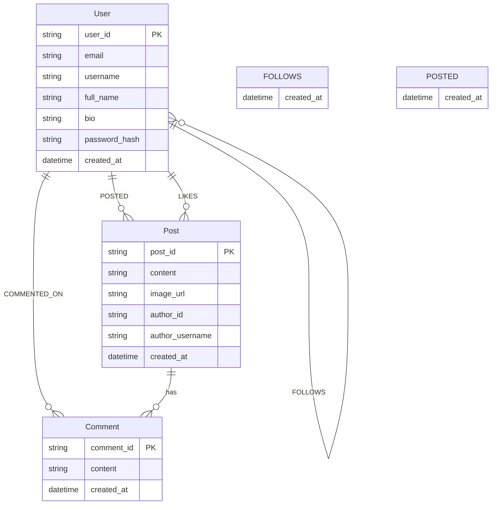

# FastAPI + Neo4j Social Network API

A RESTful social network backend built with FastAPI and Neo4j graph database,
featuring user authentication, posts, comments, likes, and follow relationships.

## Features

- User registration and JWT authentication
- User profiles with follower/following counts
- Create and retrieve posts with optional image URLs
- Like/unlike posts
- Comment on posts
- Follow/unfollow users
- Social feed (posts from followed users)
- User search by username or full name
- Mutual followers discovery
- User suggestions

## Tech Stack

| Layer      | Technology                        |
| ---------- | --------------------------------- |
| Framework  | FastAPI 0.104                     |
| Database   | Neo4j 5.x (graph)                 |
| Auth       | JWT (python-jose), OAuth2, bcrypt |
| Validation | Pydantic 2.x                      |
| Server     | Uvicorn                           |

Key packages from [requirements.txt](requirements.txt): `fastapi`, `neo4j`,
`pydantic`, `python-jose`, `passlib[bcrypt]`, `email-validator`.

## Project Structure

```
fastapi-neo4j/
├── app/
│   ├── main.py           # App entry, lifespan, router registration
│   ├── config.py         # Pydantic settings (env vars)
│   ├── database.py       # Neo4j connection manager
│   ├── models/           # Pydantic schemas
│   │   ├── auth.py       # Token, LoginRequest/Response
│   │   ├── user.py       # UserCreate, UserResponse
│   │   ├── post.py       # PostCreate/Response, CommentCreate/Response
│   │   └── social.py     # FollowResponse, UnfollowResponse
│   ├── routers/          # API route handlers
│   │   ├── auth.py       # /auth (signup, login)
│   │   ├── users.py      # /users (profile, search)
│   │   ├── posts.py      # /posts (CRUD, like, comment)
│   │   └── social.py     # /social (follow, feed, suggestions)
│   ├── services/         # Business logic, Neo4j Cypher
│   │   ├── user_service.py
│   │   ├── post_service.py
│   │   └── social_service.py
│   └── utils/
│       ├── dependencies.py   # get_db_session, get_current_user
│       ├── security.py       # JWT, password hashing
│       └── neo4j_helpers.py  # Neo4j DateTime conversion
├── requirements.txt
├── pyproject.toml        # Black, Ruff config
└── README.md
```

## Prerequisites

- Python 3.11+
- Neo4j 5.x (local or Docker)
- (Optional) Docker for Neo4j

## Installation

```bash
# Clone and enter directory
git clone <repo-url>
cd fastapi-neo4j

# Create venv and install
python -m venv venv
source venv/bin/activate  # or `venv\Scripts\activate` on Windows
pip install -r requirements.txt
```

## Configuration

Create a `.env` file in the project root (copy from [.env.example](.env.example)).
Pydantic-settings loads from `.env`.

| Variable                      | Default                 | Description          |
| ----------------------------- | ----------------------- | -------------------- |
| `NEO4J_URI`                   | `bolt://localhost:7687` | Neo4j connection URI |
| `NEO4J_USER`                  | `neo4j`                 | Neo4j username       |
| `NEO4J_PASSWORD`              | `password`              | Neo4j password       |
| `SECRET_KEY`                  | *(dev default)*         | JWT signing key      |
| `ACCESS_TOKEN_EXPIRE_MINUTES` | `30`                    | JWT expiry           |

## Running Neo4j (Docker)

```bash
docker run -d --name neo4j \
  -p 7474:7474 -p 7687:7687 \
  -e NEO4J_AUTH=neo4j/password \
  neo4j:5
```

- Neo4j Browser: `http://localhost:7474`
- Bolt: `bolt://localhost:7687`

## Running the Application

```bash
uvicorn app.main:app --reload --host 0.0.0.0
```

- API: `http://localhost:8000`
- Interactive docs: `http://localhost:8000/docs`
- ReDoc: `http://localhost:8000/redoc`

## API Endpoints

### Authentication (`/auth`)

| Method | Endpoint        | Auth | Description                     |
| ------ | --------------- | ---- | ------------------------------- |
| POST   | `/auth/signup`  | No   | Register user                   |
| POST   | `/auth/login`   | No   | Login (returns JWT + refresh)   |
| POST   | `/auth/refresh` | No   | Refresh access token            |

### Users (`/users`)

| Method | Endpoint           | Auth | Description          |
| ------ | ------------------ | ---- | -------------------- |
| GET    | `/users/me`        | Yes  | Current user profile |
| GET    | `/users/search?q=` | No   | Search users         |
| GET    | `/users/{user_id}` | No   | Get user profile     |

### Posts (`/posts`)

| Method | Endpoint                    | Auth | Description   |
| ------ | --------------------------- | ---- | ------------- |
| POST   | `/posts/`                   | Yes  | Create post   |
| GET    | `/posts/{post_id}`          | No   | Get post      |
| POST   | `/posts/{post_id}/like`     | Yes  | Like post     |
| POST   | `/posts/{post_id}/unlike`   | Yes  | Unlike post   |
| POST   | `/posts/{post_id}/comment`  | Yes  | Add comment   |
| GET    | `/posts/{post_id}/comments` | No   | List comments |

### Social (`/social`)

| Method | Endpoint                                         | Auth | Description              |
| ------ | ------------------------------------------------ | ---- | ------------------------ |
| POST   | `/social/follow/{user_id}`                       | Yes  | Follow user              |
| POST   | `/social/unfollow/{user_id}`                     | Yes  | Unfollow user            |
| GET    | `/social/followers/{user_id}`                    | No   | List followers           |
| GET    | `/social/following/{user_id}`                    | No   | List following           |
| GET    | `/social/mutual-followers/{user1_id}/{user2_id}` | No   | Mutual followers         |
| GET    | `/social/feed`                                   | Yes  | Feed from followed users |
| GET    | `/social/suggestions/{user_id}`                  | No   | User suggestions         |

## Authentication

- **Login**: `POST /auth/login` with `{"email": "...", "password": "..."}`
  returns `access_token`, `refresh_token`, and user info.
- **Refresh**: `POST /auth/refresh` with `{"refresh_token": "..."}` returns new
  `access_token` and `refresh_token` (token rotation).
- **Protected routes**: Use header `Authorization: Bearer <token>`.
- OAuth2 scheme: `OAuth2PasswordBearer` (tokenUrl: `auth/login`).

## Neo4j Graph Model



**Node labels**: `User`, `Post`, `Comment`

**Relationships**:
- `(User)-[:POSTED]->(Post)`
- `(User)-[:FOLLOWS]->(User)`
- `(User)-[:LIKES]->(Post)`
- `(User)-[:COMMENTED_ON]->(Comment)`
- `(Comment)-[:ON_POST]->(Post)`

## Example Requests

**Signup**

```bash
curl -X POST http://localhost:8000/auth/signup \
  -H "Content-Type: application/json" \
  -d '{"email":"user@example.com","username":"johndoe","full_name":"John Doe","password":"secretpass123"}'
```

**Login**

```bash
curl -X POST http://localhost:8000/auth/login \
  -H "Content-Type: application/json" \
  -d '{"email":"user@example.com","password":"secretpass123"}'
```

**Refresh token**

```bash
curl -X POST http://localhost:8000/auth/refresh \
  -H "Content-Type: application/json" \
  -d '{"refresh_token":"<your_refresh_token>"}'
```

**Create post (with token)**

```bash
curl -X POST http://localhost:8000/posts/ \
  -H "Authorization: Bearer <token>" \
  -H "Content-Type: application/json" \
  -d '{"content":"Hello world!","image_url":null}'
```

## Development

- **Formatting**: Black (line length 79), Ruff
- **Config**: [pyproject.toml](pyproject.toml)
- **Code style**: See `.cursor/rules/python-formatting.mdc` for line length
  and conventions
